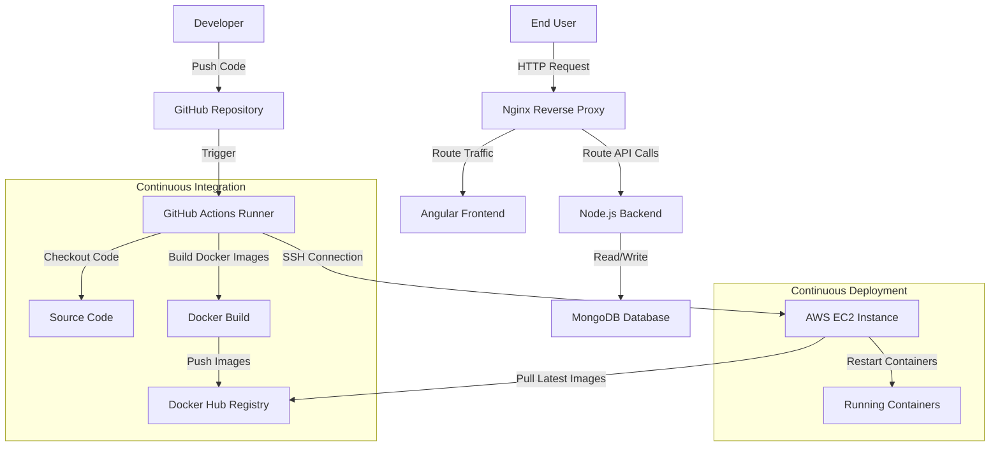
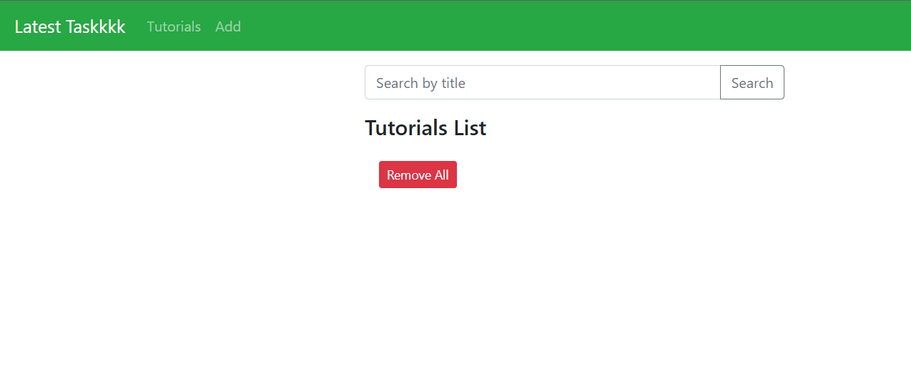
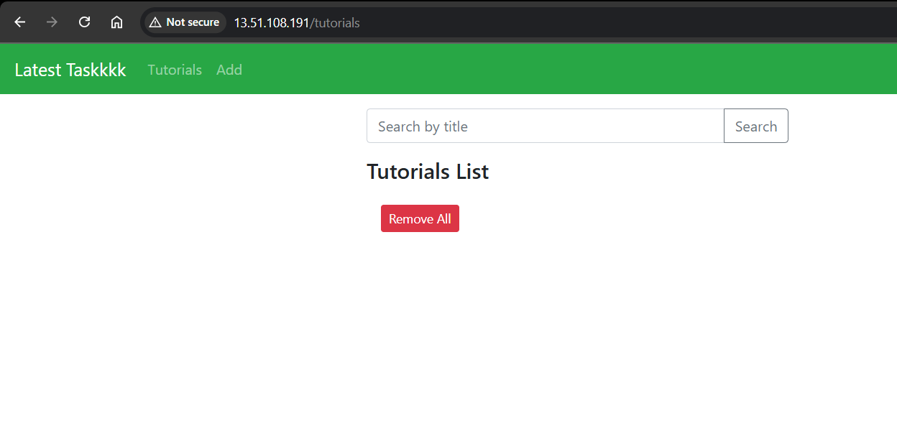

# MEAN Stack CRUD Application with DevOps Automation

This project is a full-stack web application built using the MEAN stack (MongoDB, Express.js, Angular, Node.js). It demonstrates a complete DevOps lifecycle, including containerization with Docker, orchestration with Docker Compose, and automated deployment to AWS EC2 using GitHub Actions.

## Project Architecture

The application consists of three main components:
1.  **Frontend:** An Angular 15 application that provides the user interface.
2.  **Backend:** A Node.js/Express REST API that handles business logic.
3.  **Database:** MongoDB for persistent data storage.

Traffic is managed by an Nginx reverse proxy, which routes requests to the appropriate service (Frontend or Backend).

### Deployment Flow

The following diagram illustrates the automated CI/CD pipeline:

## Docker Configuration

The project is fully containerized. You can find the configuration files here:

*   **Backend Dockerfile:** `backend/Dockerfile` - Defines the Node.js environment for the API.
*   **Frontend Dockerfile:** `frontend/Dockerfile` - Multi-stage build that compiles Angular and serves it with Nginx.
*   **Docker Compose:** `docker-compose.yml` - Orchestrates the services (MongoDB, Backend, Frontend, Nginx) and defines networking.

## CI/CD Configuration

The Continuous Integration and Deployment pipeline is defined in `.github/workflows/deploy.yml`.

**Workflow Steps:**
1.  **Build:** Checks out the code, builds Docker images for frontend and backend, and pushes them to Docker Hub.
2.  **Deploy:** Connects to the AWS EC2 instance via SSH, pulls the latest images, and restarts the application containers.

## Setup and Deployment Instructions

### Prerequisites
*   GitHub Account
*   Docker Hub Account
*   AWS Account (for EC2)

### Step 1: Infrastructure Setup
1.  Launch an Ubuntu EC2 instance on AWS.
2.  Configure the Security Group to allow traffic on Port 80 (HTTP) and Port 22 (SSH).
3.  Connect to your instance and install Docker and Docker Compose.

### Step 2: Repository Setup
1.  Clone this repository to your local machine.
2.  Create a new repository on GitHub and push the code.

### Step 3: GitHub Secrets Configuration
Go to your GitHub Repository Settings > Secrets and variables > Actions, and add the following secrets:

*   `DOCKER_USERNAME`: Your Docker Hub username.
*   `DOCKER_PASSWORD`: Your Docker Hub access token.
*   `EC2_HOST`: The Public IP of your EC2 instance.
*   `EC2_USERNAME`: The SSH username (usually `ubuntu`).
*   `EC2_SSH_KEY`: The content of your `.pem` private key file.

### Step 4: Trigger Deployment
Any push to the `main` branch will automatically trigger the pipeline.
1.  Make a change to the code.
2.  Commit and push the changes.
3.  Monitor the "Actions" tab in GitHub to see the deployment progress.

## Screenshots

### 1. CI/CD Configuration and Execution

### 2. Docker Image Build and Push

### 3. Application Deployment and Working UI

### 4. Nginx Setup and Infrastructure

## License

This project is open source and available under the MIT License.
